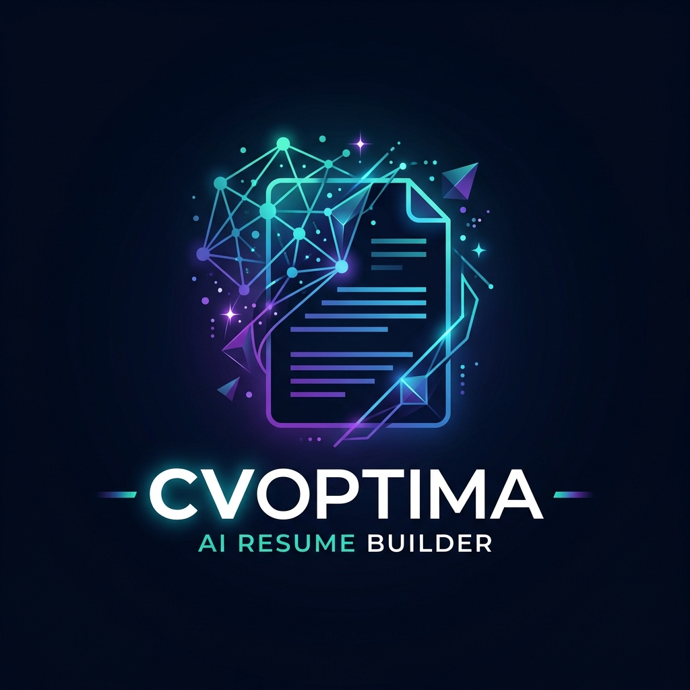
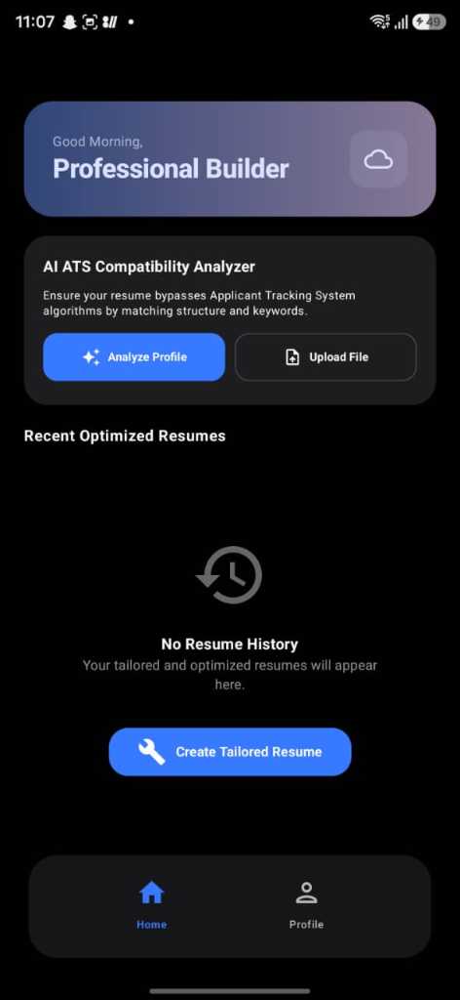
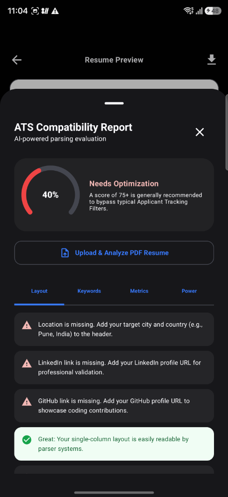
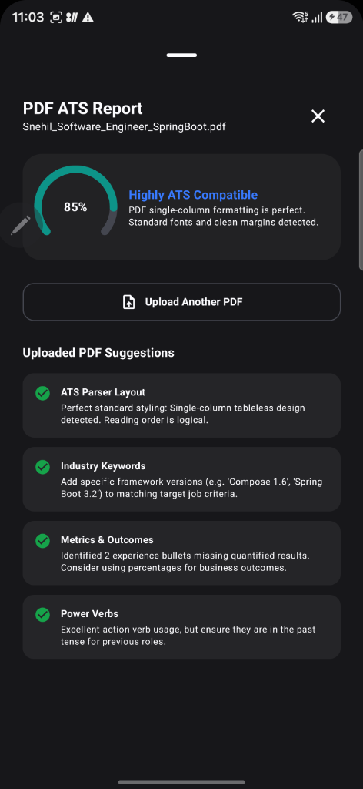

# <p align="center"><br>CVOptima: AI Resume Builder</p>

<p align="center">
  
  
  
  
  
  
</p>

---

## 📌 Project Overview
**CVOptima** is an AI-powered resume builder and optimizer application designed to help job seekers maximize their resume's match score against Applicant Tracking Systems (ATS). 

The project follows a split-module structure:
1. **Android Client Application (`/app`)**: A native Android app featuring a modern Jetpack Compose interface, offline-first data support, and dependency injection.
2. **Spring Boot Backend (`/Backend`)**: A secure Spring Boot service integrated with Spring AI (OpenAI) to optimize work experiences in real-time, featuring concurrency built on Java 21 Virtual Threads and token streaming over Server-Sent Events (SSE).

---

## ✨ Features

### 📱 Android Application
* **Modern Jetpack Compose UI**: Built with Material 3 design, smooth transitions, and premium micro-animations (Lottie integration).
* **Robust Authentication Flow**: Complete Splash, Login, and Registration screens with state management via Dagger Hilt ViewModels.
* **AI Optimization Entry Gate (`JobInputScreen`)**: A validation-locked input interface featuring structured fields for target company name, desired job title, and a large multi-line text area (240.dp) for pasting raw job descriptions. Validation automatically unlocks the optimization flow.
* **SSE Typewriter Generation (`StreamingGenerationScreen`)**: A specialized monospaced console view that listens to backend Server-Sent Events (SSE) using OkHttp's `EventSource` and renders optimized resume bullet points dynamically with auto-scroll logic.
* **Offline-First Database**: Locally caches tokens, educational history, work experiences, and skills using Android Room Database.
* **Smart Network Layer**: Features Retrofit/OkHttp with custom authentication interceptors (`AuthInterceptor`) for seamless bearer-token authorization.
* **Asynchronous Image Loading**: Integrated with Coil for fast, memory-efficient image rendering.

### ⚙️ Spring Boot Backend
* **AI Resume Optimization**: Uses Spring AI (OpenAI models) to optimize raw resume text using the **Google X-Y-Z Formula**:
  > *"Accomplished **[X]** as measured by **[Y]**, by doing **[Z]**"*
* **Real-time SSE Token Streaming**: Optimizations stream to the client word-by-word via Server-Sent Events, creating a dynamic, responsive user experience.
* **Virtual Threads Integration**: Concurrency handles high-traffic streaming requests efficiently using Java 21’s `Executors.newVirtualThreadPerTaskExecutor()`.
* **JWT Security Configuration**: Endpoints are secured using Spring Security, custom User Details service, and JSON Web Tokens (JJWT).
* **Dual Database Profiles**:
  * **Dev Profile**: Connects to a robust PostgreSQL database inside Docker.
  * **Default/Fallback Profile**: Quickstart option using an in-memory H2 database with a web-accessible console.

---

## 📸 App Walkthrough & Screenshots

### 🏠 Home Screen & ATS Card
The dashboard features a clean, professional design with a dynamic greeting card and the **AI ATS Compatibility Analyzer**. Users can choose to analyze their compiled profile directly or scan an external PDF resume.

<p align="center">
  
</p>

### 📄 Profile ATS Compatibility Report
An interactive evaluation bottom-sheet showing an animated score gauge and segmented feedback cards for Layout Compliance, Keywords, Metrics, and Action Verbs.

<p align="center">
  
</p>

### 📈 Uploaded PDF ATS Report
Selecting a PDF launches the local extractor, scans the file, and presents the identical high-fidelity ATS Report layout displaying compatibility scores and suggestions.

<p align="center">
  
</p>

---

## 🛠️ Technology Stack & Architecture

### Client-Side (Android)
* **Language:** Kotlin
* **UI Framework:** Jetpack Compose (Material 3)
* **DI Framework:** Dagger Hilt
* **Database:** Room (SQLite)
* **Networking:** Retrofit 2 + OkHttp 3
* **Image Loading:** Coil
* **Animations:** Lottie Compose

### Server-Side (Backend)
* **Language & Runtime:** Java 21
* **Framework:** Spring Boot 3.3.1
* **AI Orchestration:** Spring AI (1.0.0-M1 Milestones)
* **Security:** Spring Security + JSON Web Tokens (JJWT)
* **Persistence:** Spring Data JPA + Hibernate
* **Databases:** PostgreSQL (Prod/Dev) / H2 (Local testing)
* **Build System:** Maven 3

---

## 🔌 API Documentation

All secured endpoints require the `Authorization: Bearer <token>` header.

### 🔑 Authentication Endpoints
* **`POST /api/v1/auth/register`**: Register a new user account.
* **`POST /api/v1/auth/login`**: Authenticate and retrieve a JWT bearer token.

### 🧠 AI Optimization Endpoints
* **`POST /api/v1/ai/optimize`**: Starts an asynchronous resume experience optimization task.
  * **Payload:**
    ```json
    {
      "rawExperience": "Managed a team of developers and fixed bugs in the app.",
      "targetJobDescription": "Looking for a Lead Engineer with experience in Kotlin and high-performance Android architectures."
    }
    ```
  * **Response (Status 202 Accepted):**
    ```json
    {
      "taskId": "7a3b4e28-1b2f-48d8-99e2-9b2f672f10b2"
    }
    ```
* **`GET /api/v1/ai/optimize/{taskId}/stream`**: Opens a Server-Sent Events (SSE) connection to stream optimized text tokens.
  * **Events emitted:**
    * `token`: A piece of the generated markdown string.
    * `done`: Signals the end of the streaming task.
    * `error`: Emits any exceptions raised during processing.

### 👤 Profile & Document Endpoints
* **`GET /api/v1/profile`**: Retrieve user profile metrics and stats.
* **`GET /api/v1/documents`**: Fetch the list of resumes generated or uploaded by the authenticated user.

---

## 🚀 Getting Started

### 1. Running the Backend

#### Prerequisites
* **Java Development Kit (JDK) 21** or higher.
* **Docker Desktop** (optional, required if using PostgreSQL).
* **OpenAI API Key** (set as an environment variable).

#### Option A: Docker + PostgreSQL (Recommended)
1. Set up your environment variables:
   ```bash
   # On Windows (PowerShell)
   $env:OPENAI_API_KEY="your-api-key-here"

   # On Linux/macOS
   export OPENAI_API_KEY="your-api-key-here"
   ```
2. Navigate to the `Backend` directory and start the services:
   ```bash
   cd Backend
   docker-compose up -d
   ```
3. Run the Spring Boot application:
   ```bash
   mvnw spring-boot:run -Dspring-boot.run.profiles=dev
   ```

#### Option B: Standalone quickstart (using in-memory H2)
If you don't have Docker installed, you can run the backend with the default profile. It will spin up an in-memory database and activate the H2 console.
1. Run the Spring Boot application:
   ```bash
   cd Backend
   # On Windows
   mvnw.cmd spring-boot:run
   
   # On Linux/macOS
   ./mvnw spring-boot:run
   ```
2. The H2 Console will be accessible at: `http://localhost:8080/h2-console`
   * **JDBC URL:** `jdbc:h2:mem:resumedb`
   * **Username:** `sa`
   * **Password:** `password`

---

### 2. Running the Android Client

#### Prerequisites
* **Android Studio Ladybug (2024.2.1)** or newer.
* **Android SDK 36** installed.

#### Run Steps
1. Open the project root folder in Android Studio. Android Studio will automatically resolve the multi-module configuration.
2. Let Gradle sync project dependencies.
3. Configure the backend base URL inside the OkHttp Retrofit build config (points to `http://10.0.2.2:8080` for Android Emulator or your local IP).
4. Run the `:app` configuration on a virtual device or a physical Android phone.

---

## 📦 Deployment (Docker Compose Services)
The `docker-compose.yml` launches the following services:
* **PostgreSQL (`port 5433`)**: Relational database storage.
* **pgAdmin 4 (`port 5050`)**: Web-based administration tool for PostgreSQL.
  * **Email:** `admin@resumebuilder.com`
  * **Password:** `admin`

---

## 🤝 Contributing
Contributions are welcome! Please follow these guidelines:
1. Fork the repository.
2. Create a new branch: `git checkout -b feature-cool-new-idea`.
3. Commit your changes: `git commit -m 'Add cool new feature'`.
4. Push to the branch: `git push origin feature-cool-new-idea`.
5. Open a Pull Request.

---

## 📄 License
This project is licensed under the MIT License - see the [LICENSE](LICENSE) file for details.
